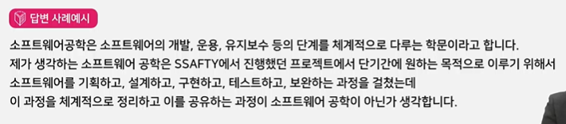
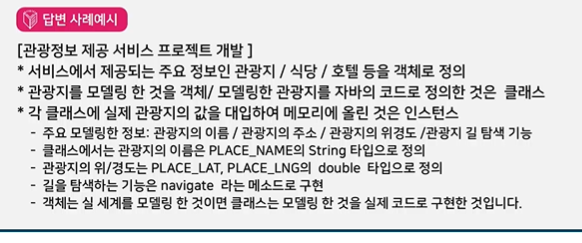

# CS 핵심 이론

---

## 소프트웨어 공학

**Q. 소프트웨어 위기에 대해서 설명하시오** 
- 정형화된 답보다는 실제 사례를 들어 설명.
- ex. 싸이월드

소프트웨어 프로세스 모델
**Q. 소프트웨어 공학이 필요한 이유는 무엇인지 설명하시오** 
- 소프트웨어 공학의 적용에 대해 예시를 들어 설명. 소프트웨어들을 비교하여 설명

소프트웨어 아키텍처
**Q. 소프트웨어 개발 경험과 소프트웨어 개발 시 적용한 개발 방법론이 있다면 설명하시오**
- 보통 1개 이상의 방법론이 적용됨. 개발 시 고려한 개발방법론이 없더라도 개발했던 경험을 복기해서 가장 적절한 개발방법론을 적용하여 설명.

*Q. 소프트웨어 프로젝트 진행 경험에 대해서 설명하시오**
- 무엇을 개발하였다 라기 보단 어떻게 개발하였다의 답변 필요. 개발방법론이나 소프트웨어 아키텍처를 들어 설명하는 것이 필요.

---

## 프로그래밍

프로그래밍 언어
객체지향 - 객체(Object)의 개념: 대상, 목적.
객체지향 주요 개념- 캡슐화, 상속, 다형성
형상관리
리팩토링

**Q.  자바와 C의 차이를 설명**
- 언어의 설계 목적에 집중. C는 운영체제에서 사용할 목적, JAVA는 모든 부분에서 사용할 수 있을 정도로 범용성이 목적이었음.
- 절차지향 vs 객체지향. 하드웨어 최적화 vs 하드웨어 독립적 등의 여러 관점에서 비교 설명.

**Q.JVM 가비지컬렉션 동작 과정을 설명하시오**
- 메모리와 연관, 소프트웨어 개발 경험 중 메모리 부족현상을 겪은 경험과 연관하여 설명

**Q. JAVA에 적용된 OOP에 대해서 설명하시오**
- 실제 작업한 사례를 통해 설명. 설계한 객체와 클래스를 비교해 설명
  

**Q. 형상관리 활용 경험을 설명하시오(C+Z/Y)**
- 형상관리의 경험이 있다면 경험 설명, 없다면 회사에서 제공하는 서비스나 소프트웨어를 대상으로 필요성 설명

**Q. 리팩토링이란 무엇인지 설명하시오**
- 프로그래밍 시 사용했던 리팩토링 경험을 이야기하거나, 작성했던 코드를 개선하는 방향으로 답변

---
## 자료구조

**Q. stack과 queue의 차이점에 대해서 설명하시오**
- 스택과 큐의 자료 구조의 방법을 설명하되, 실제 구현한 예를 사용하여 설명
  
**Q. JAVA에서 stack, heap을 설명하시오**
- 자바에서의 메모리 관리 방법을 설명, 이 중 stack 메모리와 heap 메모리의 역할과 동작방법에 대해서 설명

---

## 데이터베이스

데이터 모델링

**Q. view에 대해서 설명하시오**
- view 사용 경험을 예를 들어 설명
 
**Q. index에 대해서 설명하시오**
- index 사용 경험을 예를 들어 설명. 인덱스를 사용할 때와 사용하지 않았을 떄의 차이점을 들어 설명
  
**Q. No SQL에 대해서 설명하시오**
- No SQL은 빅데이터를 저장할 때 많이 사용함. No SQL과 관계형 데이터베이스를 비교해서 설명

---

## 컴퓨터 시스템

---

## 네트워크

---

