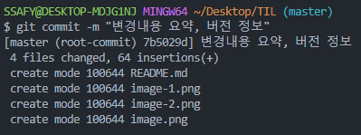
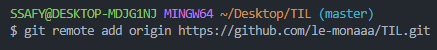
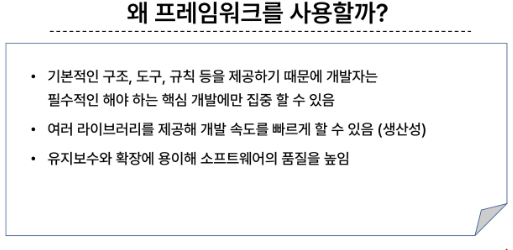
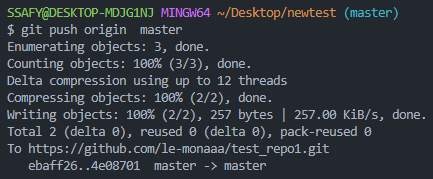

## git
- **Working Directory**
  
  -작업공간. 작업 중 파일 영역.
- **Staging Area** (git add 한 상태)
  
  -Working Directory에서 변경된 파일 중 commit 할 파일을 선택하는 공간. 중간 준비 영역.
- **Repository** (commit 한 상태)
  
  -버전 이력, 파일들 영구 저장 영역. 모든 버전, 변경 이력 기록

  working Directory->Staging Area->Repository

**commit**(=snapshot)
변경된 파일 저장. 

#### git 명령어
- **git init** : 초기화. 로컬 저장소 설정
- **git add** : 변경사항이 있는 파일 staging area에 추가 (git add . 변경사항 모두 add)
- **git commit** : git add로 추가 된 파일을 기록(버전 생성, 변경 이력 기록)

  " " 안에 커밋 메세지 작성.
- commit 전 사용자 정보 등록

  **git config --global user.email "메일주소"**

**git config --global user.name "유저네임"**

- **git log** : git 목록 확인
- **git status** : git 상태 확인
- **git remote -v** : git에 연동된 repository 확인
- **git log --oneline** : commit 목록 한 줄로 보기
- **git config --global -l** : git global 설정 정보 보기
- **local** : 사용자가 접속하고 있는 기기, 시스템
- **git remote remove** : git에 연동된 파일 저장소 연결 해제

### git 연결, 업로드 하기
1. repository 생성
2. 터미널에 git remote add 'origin' '원격repository주소'

  origin = 별칭

  

별칭을 설정해 다른 repository에 선택적으로 add, commit 할 수 있다.

3. git push -u 'origin' master

 --> u는 생략 가능하다.

### 연결된 원격 저장소에서 작업파일 내려받기
1. 변경사항만 내려받기: git pull 'origin' master
2. 원격 저장소 전체 복제: git clone '원격 저장소 주소'

### gitignore
 git에서 특정 파일, 디렉토리를 추적에서 제외하는 방법.
 제외하고 싶은 파일명.확장자 를 내부에 작성하고 저장한다.
 
 *이미 git에 등록되었던 파일, 디렉토리는 gitignore에 작성해도 적용x

하나하나 등록하기 어렵다면 http://www.toptal.com/deverlopers/gitignore/

### 주의사항
+git 내부에 git x
-->바깥 git 저장소는 내부 git 저장소의 변경사항을 추적할 수 없음

+commit시에 commit message 반드시 작성!!!
