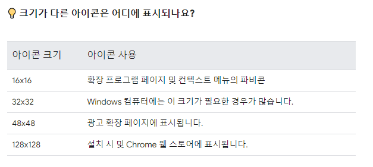

**인터페이스**

```javascript
// 인터페이스

// 선택적 속성 -?
// 읽기전용 속성 = readonly

interface User {
    name: string,
    readonly age: number,
    isValid?: boolean
}
const kim: User =  {
    name: "kim",
    age : 33,
    isValid : false,
}
kim.name = "min"
kim.age = 123 // 읽기 전용 속성이라 값을 바꿀 수 없음

const lee: User =  {
    name: "kim",
    age : 33,
    // ? 으로 선택적 속성으로 설정했기 때문에 있어도 되고 없어도 됨
}

```

```javascript
// 함수 타입 - 호출 시그니처(call signature)
// 함수타입 인터페이스
interface GetName {
    (message: string): string
}// 이 문법을 시그니처라고 함
// 재사용할필요 없으면 시그니처 없이 그냥 사용

interface User {
    name: string,
    age: number,
    getName: GetName
}


// interface User {
//     name: string,
//     age: number,
//     getName: (message:string)=> string
// }
// 재사용 필요없을 때는 이렇게 작성해도 됨

const kim: User = {
    name: "kim",
    age: 22,
    getName(message: string){
        console.log(messgae)
        return this.name
    }
}
kim.getName("~~~~")
```

---


**background.json**
: 작업 처리


**content.js**
: 현재 페이지의 정보들.
message 형태로 데이터 전달

---
### Google extension

**manifest.json**
: 설정, 버전명, 권한설정 등, 루트 디렉토리에 반드시 존재
필수키 : "manifest_version", "name", "version"
개발 중에 주석 (//)을 지원하지만 Chrome 웹 스토어에 코드를 업로드하기 전에 주석을 삭제해야 함

```
npm i chrome-types
```
: 자동완성

**content script**
: 페이지의 컨텐츠를 읽고 수정하는 스크립트 실행. 다른 페이지, 다른 익스텐션의 컨텐츠스크립트와 영향x 독립된 환경

**"matches"**
: 브라우저에서 콘텐츠 스크립트를 삽입할 사이트를 식별
<scheme>://<host><path>, 이렇게 세 부분으로 구성됨(+ *)

adjacent : 인접한

**Nullish coalescing operator**
: 널 병합 연산자 (??) 는 왼쪽 피연산자가 null 또는 undefined일 때 오른쪽 피연산자를 반환하고, 그렇지 않으면 왼쪽 피연산자를 반환하는 논리 연산자이다.

OR(||)과의 차이?
: OR은 왼쪽 피연산자가 null이거나 undefined, false 값이면 오른쪽 피연산자 반환

참고링크: https://developer.mozilla.org/ko/docs/Web/JavaScript/Reference/Operators/Nullish_coalescing


**아이콘 규격**


**서비스워커**
: 이벤트를 처리하고 필요하지 않을 때 종료되는 특수 자바스크립트 환경

참고링크: https://developer.chrome.com/docs/extensions/develop/concepts/service-workers?hl=ko

**runtime.onInstalled()**
: 확장 프로그램이 초기 상태를 설정하거나 설치 시 일부 태스크를 완료할 수 있음. 확장 프로그램은 Storage API 및 IndexedDB를 사용하여 애플리케이션 상태를 저장

**scripting.executeScript()**
: 자바스크립트를 삽입

(https://developer.chrome.com/docs/extensions/get-started/tutorial/service-worker-events?hl=ko)