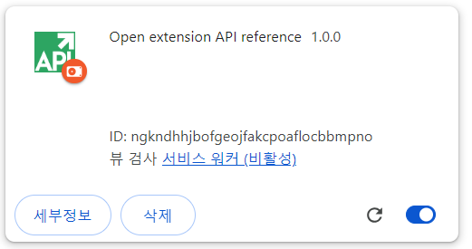

### Git 

**gitflow**
: git에서 제공하는 브랜칭 기능을 활용한 변경 이력 관리 전략

[참고링크] git flow란, 깃 브랜치 전략
https://puleugo.tistory.com/107

**gitflow 전략**
    - 5가지 브랜치로 관리: msater, develop, feature, release, hotfix
    - 브랜치별 목적이 정확
    - 브랜치별 생명 주기에 따른 처리

그 외에도 다양한 브랜치 전략(github flow, gitlab flow)이 있으나 장단점 잘 확인하고 이용(ex. gitflow 보다 형태 단순, 배포가 잦은 환경에 적합함....)

**git history**
- git history의 중요성 
- : 레거시 코드 유지 보수에 중요, 버그 발생 시점 파악 및 문제 해결 실마리 제공

---

### 설계 산출물

**산출물이 필요한 이유**
(== 문서화가 중요한 이유..) 
- 프로젝트에 대한 명확한 이해, 합의를 위해서
- 효율적인 계획 및 관리를 위해서
- 팀원 간 의사소통 강화 가능

**종류**
- 기획서 : 주제/목표/기획배경/주요기능/기대효과 등등
  - 프로젝트의 방향성 설립. 
  - 한 줄로 서비스를 표현할 수 있어야 함
- 요구사항 정의서: 고객이 원하는 기능 나열
  - 구분, 요구사항, 기능명, 기능 상세 설명, 우선순위, 상태
- 기능 명세서: 요구사항을 개발자의 입장에서 정리. 
  - 시스템 운영을 위해 필요한 모든 기능에 대해 작성. 
  - 이 기능 명세서만을 보고도 개발이 가능한가?
- API 연동 규격서: api 주소, method, request, response, 오류 메시지 등등. 
  - FE/BE가 함께 작성. 
  - 테스트 코드 작성 시 유용
- 개발 일정표: WBS, 간트차트 등. 전체 일정 및 업무 파악.   
  - 기간, 구분, 작업, 담당자, 진행상태... 
  - 최대한 세세하게 작성
  - 구글 시트 템플릿에 프로젝트 관리-간트차트 참고
- 화면 설계: 전체적인 컨셉 설정.
  - 사용자 경험 향상 목표.
  - 프론트엔드만의 업무가 아님

**추가 산출물**
- ERD, 시스템 아키텍처, ... 

모든 산출물이 요구되진 않음. 필요한 산출물만 작성하되 많을수록 설계가 탄탄해진다.

git convention, code convention 도 정리

---

### chome extension

**ES module**
: ES6에 도입된 모듈 시스템. import, export를 사용해 분리된 자바스크립트 파일끼리 서로 접근 가능하게 함.

모듈은 함수와 변수를 모듈 스코프에 넣고, 각 함수는 함수 스코프를 가진다.
-- export로 이 scope 내의 변수, 함수를 다른 모듈에서 import를 통해 의존할 수 있도록 지정할 수 있음.

장점: 의존성 파악 용이, 모듈화, 관계없는 모듈간의 오염 방지

[참고링크] ES Modules 정리하기
https://velog.io/@jjunyjjuny/ES-Modules-%EC%A0%95%EB%A6%AC%ED%95%98%EA%B8%B0

#### 서비스워커로 이벤트 처리하기

1. 매니페스트에서ㅑ 서비스워커를 ES 모듈로 선언
```javascript

// manifest.json

{
    "manifest_version": 3,
    "name": "Open extension API reference",
    "version": "1.0.0",
    "icons": {
      "16": "images/icon-16.png",
      "128": "images/icon-128.png"
    },
    "background": {
      "service_worker": "service-worker.js"
    }
  }

```

2. service-worker.js 파일 생성
```javascript
// service-worker.js
import './sw-omnibox.js';
import './sw-tips.js';

```

[참고링크] script 가져오기
https://developer.chrome.com/docs/extensions/develop/concepts/service-workers/basics?hl=ko#import-scripts

3. 하위 파일 생성
```javascript
// sw-omnibox.js
console.log("sw-omnibox.js")
```
```javascript
// sw-tips.js
console.log("sw-tips.js")
```

4. 결과확인
   : 서비스 워커 사용 후 30초가 지나자 서비스워커(비활성)이 되었다. 서비스워커는 이벤트 발생시에만 활성화됨

   

**저장소 엑세스 요청**
: manifest.json에서 권한 요청. key = "permission"
```
// manifest.json에 추가.
"permissions": ["storage"],
```
**서비스워커 특징**
: window 객체에 직접 엑세스 불가. 단기 실행환경이므로 전역 변수와 호환되지 않음. 대신 로컬에 데이터를 저장. [chrome.storage.local][api-storage-local] 을 사용

[참고링크] 전역 변수를 사용하는 대신 데이터 유지
https://developer.chrome.com/docs/extensions/develop/concepts/service-workers/lifecycle?hl=ko#persist-data


모든 이벤트 리스너는 서비스 워커의 전역 범위에 정적으로 등록되어야 합니다. 즉, 이벤트 리스너는 비동기 함수에 중첩되어서는 안 됩니다. 이렇게 하면 서비스 워커가 재부팅되는 경우 Chrome에서 모든 이벤트 핸들러가 복원됩니다.

**동기/비동기**
- 동기 : 서버에서 요청 보낸 후 응답이 돌아와야 다음 동작 수행. 순차적 작업
- 비동기 : 요청을 보낸 후 응답과 상관없이 다음 동작 수행.

setTimeout() 또는 setInterval() 메서드는 일반적으로 지연된 작업이나 주기적 작업을 실행하는 데 사용.
그러나 서비스 워커가 종료되면 스케줄러가 타이머를 취소함.
--> 확장 프로그램은 chrome.alarms API를 사용할 수 있음

[참고링크] chrome.alarms 
https://developer.chrome.com/docs/extensions/reference/api/alarms?hl=ko
-- manifest 권한 요청 필요

[참고링크] 확장 프로그램 서비스 워커 수명 주기
https://developer.chrome.com/docs/extensions/develop/concepts/service-workers/lifecycle?hl=ko
-- 모든 Chrome API 이벤트 리스너 및 메서드는 서비스 워커의 30초 종료 타이머를 다시 시작

[참고링크] Match patterns | Extensions - Chrome for Developers
https://developer.chrome.com/docs/extensions/develop/concepts/match-patterns?hl=ko

[참고링크] mdn "content_scripts"
https://developer.mozilla.org/en-US/docs/Mozilla/Add-ons/WebExtensions/manifest.json/content_scripts

matches : 스크립트를 로드하기 위해 일치시킬 URL 패턴을 지정하는 키. 


#### manifest.json

**"action"** 
: Google 툴바에서 확장 프로그램 아이콘의 모양과 동작을 정의함.
https://developer.chrome.com/docs/extensions/reference/api/action?hl=ko

**"background"** 
: 이벤트 핸들러 역할을 하는 확장 프로그램의 서비스 워커가 포함된 자바스크립트 파일을 지정.
https://developer.chrome.com/docs/extensions/develop/concepts/service-workers?hl=ko

**"cross_origin_opener_policy"**
: COOP(Cross-Origin-Opener-Policy)
top-level document가 cross-origin 상태의 document와 browsing context group을 공유하지 못하도록 제한하는 보안 정책이자 헤더

**"declarative_net_request"**
: 네트워크 요청의 차단 및 수정을 허용하는 declarativeNetRequest API의 정적 규칙을 정의합니다.
-> 페이지 내용 접근하지 않고도 네트워크 요청에 관여해 사용자 정보 보호 및 extension에서 요청 평가하는 과정 생략이 가능해짐 (보안 강화 및 성능 개선 목적)
https://developer.chrome.com/docs/extensions/reference/api/declarativeNetRequest?hl=ko\
  - **"rule_resources"**
    - https://developer.chrome.com/docs/extensions/reference/api/declarativeNetRequest?hl=ko%5C#manifest
  - declarativeNetRequest 사용하는 이유?
    - 페이지 내용에 접근하지 않고도 네트워크 요청을 막을 수 있고 사용자 권한을 요구하지 않음(사용자 정보 접근x), 성능적인 측면에서도 이득
    - 이전엔 webRequest API 사용했었다.
    - webRequest API 사용시) 브라우저는 extension에 요청을 보내는 네트워크에 모든 데이터를 전달, extension이 이를 평가 후 브라우저에 행동을 알려줌. 이 때 host permission이 필요하게 되고 각각의 네트워크 요청은 메인 extension 과정에서 평가하게 되면서 성능 저하로 이어질 수 있음. 개발자는 편리하지만 extension이 사용자가 웹에서 뭘 하는 지에 대한 모든 정보를 읽을 수 있다는 단점.
    - webRequest API의 blocking version- extension이 네트워크 요청을 intercept 하거나 block하는 것을 금지함. 페이지 내용 altering도 금지. 광고 차단 서비스 같은 데엔 유용하겠지만 code injection의 위험이 존재하며 사용자의 정보에 어프로치 할 수 있음.

**"permissions"**
: 특정 확장 프로그램 API를 사용 설정합니다. 개별 API의 참조 페이지에는 필요한 권한이 나와 있습니다.
https://developer.chrome.com/docs/extensions/reference/api/permissions?hl=ko
 - "unlimitedStorage" 
   -  chrome.storage.local, IndexedDB에 무제한 할당량을 제공
   - chrome storage: https://developer.chrome.com/docs/extensions/reference/api/storage?hl=ko
    - storage.local
     - 데이터가 로컬에 저장되며 extension이 삭제되면 삭제됨. 저장용량 한도는 10MB (Chrome 113 및 이전 버전의 경우 5MB)이지만 unlimitedStorage" 권한을 요청하여 확장 가능. 권장되는 사항.
    - IndexedDB API 
     - 파일이나 블롭 등 많은 양의 구조화된 데이터를 클라이언트에 저장하기 위한 로우 레벨 API.인덱스를 사용해 데이터를 고성능으로 탐색. 많은 양의 구조화된 데이터 저장에 유용함.(+ 적은 양의 데이터는 Web Storage)
     - 원본 비공개 파일 시스템
       - https://web.dev/articles/origin-private-file-system?hl=ko
    - "storage"
     - chrome.storage API에 대한 액세스 권한을 부여.
     - https://developer.chrome.com/docs/extensions/reference/api/storage?hl=ko
     - 제한 및 한도 있기 때문에 성능 비용에 있어서 고려해봐야 함.
     - 저장용량 한도 및 한도초과 관련 사항--sync, local, session 참고
   - "declarativeNetRequest"
     - API는 선언적 규칙을 지정하여 네트워크 요청을 차단하거나 수정하는 데 사용.
     - 확장 프로그램에서 네트워크 요청을 가로채서 콘텐츠를 보지 않고도 네트워크 요청을 수정할 수 있으므로 개인 정보 보호가 강화됨
     -  https://developer.chrome.com/docs/extensions/reference/api/declarativeNetRequest?hl=ko
   - "declarativeNetRequestWithHostAcces"
     - 권한 경고가 없지만 호스트에서 작업을 수행하려면 먼저 호스트 권한을 요청해야 합니다. 이는 추가 경고 생성 없이 이미 호스트 권한이 있는 확장 프로그램에서 선언적 순 요청 규칙을 사용하려는 경우에 적합합니다.  

**"host_permissions"**
: 하나 이상의 호스트에 액세스 권한을 부여하는 하나 이상의 일치 패턴을 포함합니다. 
 - 확장 프로그램이 상호작용할 수 있는 웹페이지를 나열하며 URL 일치 패턴을 사용하여 정의됩니다. 이러한 사이트에 관한 사용자 권한은 설치 시 요청됩니다. 
https://developer.chrome.com/docs/extensions/develop/concepts/declare-permissions?hl=ko

**"web_accessible_resources"**
: 웹페이지 또는 다른 확장 프로그램에서 액세스할 수 있는 확장 프로그램 내에서 파일을 정의합니다. 
https://developer.chrome.com/docs/extensions/reference/manifest/web-accessible-resources?hl=ko

**"content_scripts"**
: 사용자가 특정 웹페이지를 열 때 사용할 자바스크립트 또는 CSS 파일을 지정합니다. 
https://developer.chrome.com/docs/extensions/develop/concepts/content-scripts?hl=ko
  - "content_script.matches"
    - 콘텐츠 스크립트가 하나 이상의 호스트에 삽입할 수 있도록 하는 하나 이상의 일치 패턴을 포함합니다. 변경 시 경고가 트리거될 수 있습니다.
    - https://developer.chrome.com/docs/extensions/develop/concepts/content-scripts?hl=ko#static-declarative

---

#### /library

**jquery** 
: HTML의 클라이언트 사이드 조작을 단순화 하도록 설계된 크로스 플랫폼의 자바스크립트 라이브러리.

**sementic ui**
: Semantic-UI 부트스트랩과 같은 디자인 라이브러리.

**JSZip**
:  여러개의 파일을 하나의 파일로 묶어 압축하고 압축된 파일 하나에만 사용자의 선택 행위가 적용되도록 하는 자바스크립트 라이브러리. 
https://stuk.github.io/jszip/documentation/examples.html
http://www.gisdeveloper.co.kr/?p=8936

**sha1.min.js**
: 자바스크립트에서 sha-1을 구현하는 라이브러리.
https://github.com/kazuho/sha1.min.js/blob/master/README.md

