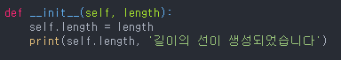
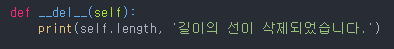

##  \_\_init\_\_ (생성자)
(언더바 두개씩)

생성자(constructor)
객체가 생성될 때 해당 객체의 멤버 변수 등 초기화가 필요한 데이터를 객체가 생성될 때 초기화 해주는 역할

-생성자가 없을경우

: 객체 생성 후 바로 호출시에 에러가 생길 수 있음

-생성자 생성법: 
```
멤버함수명 __init__
def __init__(self, 매개변수1, 매개변수2, ..):

    self.멤버변수 = 매개변수1
```
기능 동작이 목적이 아니라 초기화가 목적.
객체 생성 시 동시에 호출되는 함수.

객체 생성->생성자 호출->멤버변수초기화->객체를 통한 기능 수행 



## \_\_del\_\_ (소멸자)

객체가 없어질 때 호출되는 메서드.
객체가 없어지기 전에 처리해야 할 게 필요할 때 사용.


## __repr__ (프린팅) 
객체를 사용자가 이해할 수 있는 문자열로 반환.

## str, __str__ str
입력 받은 객체의 문자열 버전을 반환하는 함수. str은 내장 함수가 아니라 파이썬 기본 내장 클래스이디ㅣㅏ.

## __str__과 __repr__의 차이 
__str__ : 인자를 문자열화 해서 반환. 객체를 표현하는 것 보다는 추가 가공이나 다른 데이터와의 호환을 위해 문자열화 하는데 있다. 다른 자료형 간에 인터페이스 제공

## __repr__
객체를 인간이 이해할 수 있는 평문으로 표현 하는 것이 목적.

## __add__ (덧셈) __lt__ (비교)

## \_\_메소드\_\_ 
내장된 자료형들에, 해당 자료형에 대한 연산을 정의하는 메소드가 있음. 

ex) 어떤 값에 대해서 '+', '-' 등등 연산자를 취하는 것은 '__add__', '__sub__' 메소드를 실행하는 것과 동일함.

## 예외처리(try, except)
try 밑에 기본 문장 except: 예외 발생 시 처리할 부분.

https://wikidocs.net/26

https://recordnb.tistory.com/47

https://dkswnkk.tistory.com/355

https://rangsub.tistory.com/124

https://wikidocs.net/89